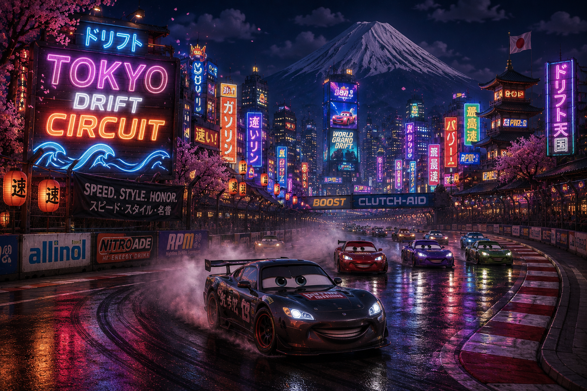

# 🏁 Piston Cup Central

> An interactive AR race experience inspired by the Pixar Cars universe.



## 📖 About

Piston Cup Central is a web application that lets users browse race tracks from the Cars universe and launch an Augmented Reality race experience on their phone. Select a track on the website, scan the QR code with the app, place the AR track on any flat surface, and race.

## ✨ Features

### Website
- Browse and select from multiple Cars-themed race tracks
- Track info including length, surface type and difficulty
- QR code per track to launch the AR experience
- Auto-rotating featured track with progress bar
- Instructions overlay
- Fully responsive design

### AR App (Unity)
- Place a 3D race track in the real world via AR
- Race bots with varying speeds for replayability
- In-race leaderboard showing position and lap
- Countdown timer visible from any angle
- Gas input to control your car's speed

## 🛠️ Tech Stack

| Layer | Technology |
|-------|-----------|
| Frontend | React + TypeScript |
| Styling | Tailwind CSS v4 |
| AR | Unity |
| Build tool | Vite |

## 🚀 Getting Started

### Prerequisites
- Node.js 18+
- npm or yarn

### Installation

```bash
# Clone the repository
git clone https://github.com/your-username/piston-cup-central.git

# Navigate to project
cd piston-cup-central

# Install dependencies
npm install

# Start development server
npm run dev
```

The app will be available at `http://localhost:5173`

## 📁 Project Structure

```
src/
├── assets/          # Race track images
├── components/
│   ├── FeaturedTrackInfo.tsx   # Featured track card with progress bar
│   ├── Header.tsx              # Header with instructions overlay
│   ├── MoreTracks.tsx          # Scrollable track list
│   └── TrackInfoRow.tsx        # Individual track row
├── data/
│   └── mock.ts      # Track data
├── types/
│   └── Track.ts     # Track type definition
├── App.tsx          # Main app with auto-rotation logic
└── index.css        # Global styles and Tailwind theme
```

## 🎮 How to Play

1. **Pick a track** from the list on the right
2. **Download** the Piston Cup Central app on your phone
3. **Scan the QR code** on the website with the app
4. **Place the track** on a flat surface
5. **Hit the gas** and race to the finish!

## 🔮 Future Features

- QR code linking between website and AR app
- Multiple selectable tracks in AR
- Reward system with unlockable content
- Online leaderboard with best lap times
- Track size and rotation adjustment

## 👤 Author

**Niek van den Berg**
Student — ICTUI, Hogeschool Windesheim
S1197189

---

*Built as part of the individual AR project — Cyclus 5, Datapunt 12*

---

## ⚠️ Disclaimer

This is a non-commercial student project created for educational purposes only. Cars, Piston Cup, Lightning McQueen, and all related characters and trademarks are the property of Disney/Pixar. This project is not affiliated with, endorsed by, or connected to Disney or Pixar in any way. No copyright infringement is intended.
